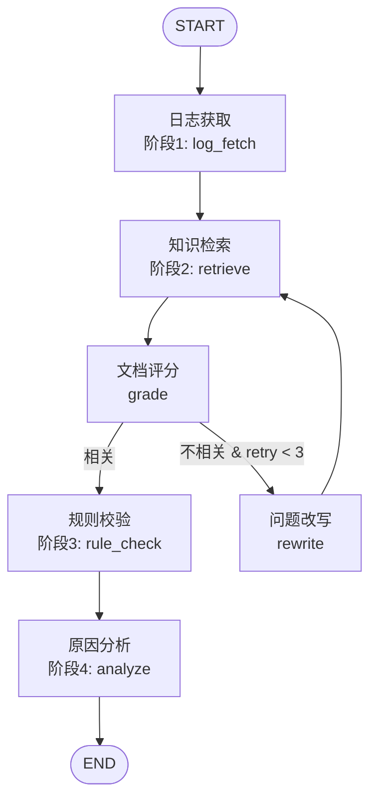

# NIO Diagnosis Agent — 项目实现文档

> 基于 LangChain + LangGraph 的 RAG Agent 工作流，模拟蔚来汽车效能平台 AI 智能诊断系统。

---

## 一、项目概述

### 1.1 项目定位

本项目是一个**面试展示级 Demo**，复刻并升级了蔚来效能平台中的故障智能诊断系统。将原有的"四阶段流水线"（日志获取→知识检索→规则校验→原因分析）升级为具有**状态管理、条件路由、循环重试**的 RAG Agent。

### 1.2 技术选型

```
LangChain (LCEL)          → RAG 组件层：文档加载、向量化、检索
LangGraph (StateGraph)    → Agent 编排层：四阶段流水线、条件路由、状态管理
FastAPI + SSE             → Web API 层：实时流式推送节点执行状态
React + React Flow        → 前端展示层：Agent 工作流可视化、诊断报告渲染
DeepSeek / 通义千问        → LLM 推理层：问题改写、文档评分、答案生成
FAISS                     → 向量存储层：本地轻量级，无需额外服务
```

**为什么需要 LangChain + LangGraph 组合？**

- LangChain 提供成熟的 RAG 基础组件（CSVLoader、Embeddings、FAISS、@tool），但原生 Chain 是线性的，无法处理条件分支和循环
- LangGraph 的 StateGraph 天然支持条件路由和循环边，但不提供任何 RAG 基础组件
- 两者组合：LangChain 负责"做什么"（RAG 能力），LangGraph 负责"怎么编排"（流程控制）

### 1.3 Agent 工作流



---

## 二、核心代码讲解

### 2.1 State 设计 — 全局状态管理（`src/graph.py`）

LangGraph 的核心是 **State**：一个 `TypedDict`，在所有节点间共享。每个节点接收当前 State、返回部分更新，LangGraph 自动合并。

```python
class DiagnosisState(TypedDict):
    question: str                      # 用户原始问题
    log_data: str                      # 拉取的日志数据
    retrieved_docs: str                # 检索到的历史案例和测试报告
    is_relevant: bool                  # 文档评分结果
    rewritten_question: str            # 改写后的问题
    rule_check_result: str             # 规则校验结果
    diagnosis_report: str              # 最终诊断报告
    retry_count: int                   # 重试次数
    messages: Annotated[list, add]     # 消息历史（累加模式）
```

**关键设计决策：**

1. `retrieved_docs` 使用 `str` 而非 `list[Document]`：LangGraph 状态序列化复杂对象时可能出问题，在节点内部完成序列化（将 Document 列表拼接为字符串），State 中只存 Python 原始类型
2. `messages` 使用 `Annotated[list, add]`：`add` 是 LangGraph 的 reducer，表示新消息**追加**到列表而非覆盖
3. `retry_count` 作为重试计数器，配合 `MAX_RETRY_COUNT` 限制循环次数

### 2.2 配置管理 — 多供应商适配（`src/config.py`）

支持 3 种 LLM 供应商，按优先级自动选择：**OpenAI 兼容 API > DeepSeek > 通义千问**

```python
# 供应商优先级：openai > deepseek > tongyi > mock
# openai 模式支持任意 OpenAI 兼容 API（阿里内部路由、vLLM、Ollama 等）
OPENAI_API_KEY = os.getenv("OPENAI_API_KEY", "")
OPENAI_BASE_URL = os.getenv("OPENAI_BASE_URL", "")
OPENAI_MODEL = os.getenv("OPENAI_MODEL", "gpt-4o-mini")

if OPENAI_API_KEY and OPENAI_BASE_URL:
    LLM_PROVIDER = "openai"
elif DEEPSEEK_API_KEY:
    LLM_PROVIDER = "deepseek"
...

def get_llm():
    if LLM_PROVIDER == "openai":
        # 支持任意 OpenAI 兼容 API：阿里内部路由、vLLM、Ollama 等
        from langchain_openai import ChatOpenAI
        return ChatOpenAI(
            model=OPENAI_MODEL,          # 如 deepseek-v3.2-thinking
            api_key=OPENAI_API_KEY,
            base_url=OPENAI_BASE_URL,     # 如 https://routify.alibaba-inc.com/protocol/openai/v1
            temperature=0,
            max_tokens=4096,
        )
    elif LLM_PROVIDER == "deepseek":
        from langchain_deepseek import ChatDeepSeek
        return ChatDeepSeek(model="deepseek-chat", api_key=DEEPSEEK_API_KEY, temperature=0)
    ...

def get_embeddings():
    if EMBEDDING_PROVIDER == "openai":
        # 尝试使用 OpenAI 兼容端点的 embedding
        from langchain_openai import OpenAIEmbeddings
        return OpenAIEmbeddings(api_key=OPENAI_API_KEY, base_url=OPENAI_BASE_URL)
    elif EMBEDDING_PROVIDER == "tongyi":
        from langchain_community.embeddings import DashScopeEmbeddings
        return DashScopeEmbeddings(model="text-embedding-v2", dashscope_api_key=DASHSCOPE_API_KEY)
    else:
        # 降级：HuggingFace 本地模型（无需 API Key，支持离线）
        from langchain_huggingface import HuggingFaceEmbeddings
        return HuggingFaceEmbeddings(model_name="sentence-transformers/paraphrase-multilingual-MiniLM-L12-v2")
```

**关键设计：**
- `temperature=0`：诊断场景需要确定性输出，避免随机性
- **OpenAI 兼容 API 优先**：只需 3 个环境变量（`OPENAI_API_KEY` + `OPENAI_BASE_URL` + `OPENAI_MODEL`）即可接入任意 OpenAI 兼容端点
- **Embedding 与 LLM 解耦**：LLM 用 API 调用，Embedding 可独立配置（`EMBEDDING_PROVIDER` 环境变量覆盖）。部分端点不支持 embedding API，此时降级为 HuggingFace 本地模型（`paraphrase-multilingual-MiniLM-L12-v2`，471MB，支持中文，首次下载后缓存离线使用）
- 集中式配置管理，所有路径、参数、阈值在 `config.py` 统一定义

**环境变量配置示例：**

```bash
# 方式1：OpenAI 兼容 API（如阿里内部路由）
export OPENAI_API_KEY=sk-your_key
export OPENAI_BASE_URL=https://routify.alibaba-inc.com/protocol/openai/v1
export OPENAI_MODEL=deepseek-v3.2-thinking
export EMBEDDING_PROVIDER=huggingface  # 端点不支持 embedding 时用本地模型

# 方式2：DeepSeek 官方 API
export DEEPSEEK_API_KEY=your_key

# 方式3：通义千问 API
export DASHSCOPE_API_KEY=your_key
```

### 2.3 RAG 知识库构建 — LangChain RAG 链路（`src/tools/knowledge_retriever.py`）

这是 LangChain 在本项目中最核心的贡献——完整的 RAG 基础设施：

```python
def _build_vectorstore() -> FAISS:
    """构建 FAISS 向量库：加载历史案例 CSV → 分割 → 向量化"""
    # Step 1: 加载历史案例
    loader = CSVLoader(file_path=str(HISTORICAL_CASES_PATH))
    documents = loader.load()

    # Step 2: 为每个文档注入业务术语上下文（提升 embedding 质量）
    terminology = _load_terminology()
    for doc in documents:
        doc.page_content = f"[术语参考] {terminology}\n\n{doc.page_content}"

    # Step 3: 分割文档（支持中文分隔符）
    text_splitter = RecursiveCharacterTextSplitter(
        chunk_size=500, chunk_overlap=50,
        separators=["\n", "。", "；", "，", " ", ""],
    )
    splits = text_splitter.split_documents(documents)

    # Step 4: 向量化并存入 FAISS
    embeddings = get_embeddings()
    vectorstore = FAISS.from_documents(splits, embeddings)

    # Step 5: 持久化到本地（支持离线运行）
    vectorstore.save_local(FAISS_INDEX_PATH)
    return vectorstore
```

**关键设计：**
- **术语注入**：在 embedding 前将业务术语表（如 `BMS=电池管理系统`）拼接到文档内容前，帮助 embedding 模型理解专业术语
- **本地持久化**：`save_local` / `load_local` 实现 FAISS 索引的磁盘存储，面试现场网络不稳定时可离线运行
- **懒加载 + 缓存**：`@lru_cache(maxsize=1)` 确保向量库只构建一次

```python
@tool
def retrieve_cases(query: str) -> str:
    """从历史故障案例知识库中检索与问题相关的案例"""
    vectorstore = _get_vectorstore()
    retriever = vectorstore.as_retriever(
        search_type="similarity",
        search_kwargs={"k": 4},  # 返回 Top-4 相关文档
    )
    docs = retriever.invoke(query)
    # 将 Document 列表序列化为字符串
    return "\n".join(f"--- 相似案例 {i} ---\n{doc.page_content}\n" for i, doc in enumerate(docs, 1))
```

**`@tool` 装饰器的作用**：将普通 Python 函数封装为 LangChain Tool，统一了工具的调用接口（`.invoke()`），使 LangGraph 节点可以无差别调用。

### 2.4 Agent 工具层 — 业务能力封装

#### 2.4.1 日志获取工具（`src/tools/log_fetcher.py`）

```python
@tool
def fetch_logs(query: str) -> str:
    """从车载系统异常日志库中检索与问题相关的日志记录"""
    logs = _load_logs()
    query_lower = query.lower()

    # 多字段关键词匹配
    matched = []
    for log in logs:
        searchable_fields = [log.get("component", ""), log.get("error_code", ""),
                             log.get("message", ""), log.get("context", "")]
        searchable = " ".join(searchable_fields).lower()
        if any(kw in searchable for kw in query_lower.split()):
            matched.append(log)

    # 降级策略：没匹配到则返回所有 ERROR 级别日志
    if not matched:
        matched = [log for log in logs if log.get("level") == "ERROR"]

    # 去重 + 格式化输出
    return "\n---\n".join(format_log(log) for log in unique)
```

#### 2.4.2 规则校验工具（`src/tools/rule_validator.py`）

```python
@tool
def validate_rules(error_code: str) -> str:
    """根据错误码从业务 Schema 中查询校验规则"""
    schema = _load_schema()
    code_info = schema["error_code_mappings"].get(error_code, {})

    # 模糊匹配：精确匹配失败时尝试子串匹配
    if not code_info:
        for code, info in code_mappings.items():
            if error_code.lower() in code.lower():
                code_info = info
                break

    # 关联查询：错误码 → 组件 → 依赖关系 → 校验规则 → 术语表
    return format_result(code_info, applicable_rules, component_deps, term_def)
```

### 2.5 LangGraph 节点层 — 四阶段流水线

每个节点是一个 `(state: dict) -> dict` 函数：接收当前状态，返回状态更新。

#### 阶段1: 日志获取节点（`src/nodes/log_fetch_node.py`）

```python
def log_fetch_node(state: dict) -> dict:
    question = state.get("question", "")
    start_time = time.time()

    log_data = fetch_logs.invoke({"query": question})  # 调用 @tool
    elapsed = time.time() - start_time

    console.print(f"  [dim]获取到日志数据 ({len(log_data)} 字符) | 耗时: {elapsed:.2f}s[/dim]")

    return {
        "log_data": log_data,  # 状态更新
        "messages": [{"role": "system", "content": "[日志数据已获取]"}],
    }
```

#### 阶段2: 知识检索节点（`src/nodes/retrieve_node.py`）

```python
def retrieve_node(state: dict) -> dict:
    # 优先使用改写后的问题（如果上一轮检索不相关触发了改写）
    query = state.get("rewritten_question") or state.get("question", "")

    # 双路检索：向量检索历史案例 + 关键词检索测试报告
    cases_result = retrieve_cases.invoke({"query": query})
    test_data_result = fetch_test_data.invoke({"query": query})

    combined_docs = f"=== 历史案例 ===\n{cases_result}\n\n=== 测试报告 ===\n{test_data_result}"

    return {
        "retrieved_docs": combined_docs,
        "rewritten_question": "",  # 清空改写问题，避免重复使用
    }
```

#### 文档评分节点 — 条件路由的核心（`src/nodes/grade_node.py`）

这是整个 Agent **最关键的节点**，决定了流程是继续还是循环重试。

```python
# Pydantic 模型：约束 LLM 输出格式
class GradeDocuments(BaseModel):
    """检索文档相关性评分"""
    binary_score: str = Field(description="相关性评分：'yes' 表示相关，'no' 表示不相关")
    reasoning: str = Field(description="评分理由")

def grade_node(state: dict) -> dict:
    """节点函数：调用 LLM 评分，返回状态更新"""
    question = state.get("question", "")
    context = state.get("retrieved_docs", "")

    # 快速判断：检索结果为空或过短，直接判定不相关
    if not context or len(context) < 50:
        return {"is_relevant": False}

    # LLM 评分（structured output 约束输出格式）
    llm = get_llm()
    prompt = GRADE_PROMPT.format(question=question, context=context[:3000])
    response = _invoke_llm_with_retry(llm, [{"role": "user", "content": prompt}], GradeDocuments)

    if response is None:
        # LLM 不可用时降级：默认相关，避免阻塞流程
        return {"is_relevant": True}

    return {"is_relevant": response.binary_score == "yes"}


def route_after_grading(state: dict) -> Literal["rule_check", "rewrite"]:
    """条件路由函数：根据评分结果决定下一步走向"""
    is_relevant = state.get("is_relevant", False)
    retry_count = state.get("retry_count", 0)

    if is_relevant:
        return "rule_check"           # 相关 → 进入规则校验

    if retry_count >= MAX_RETRY_COUNT:  # 默认 3
        return "rule_check"           # 不相关但已达重试上限 → 降级进入校验

    return "rewrite"                  # 不相关且未达上限 → 改写问题重试
```

**关键设计：**
- **Structured Output**：使用 Pydantic `BaseModel` + `with_structured_output()` 约束 LLM 输出为结构化数据，避免解析自然语言
- **节点函数 vs 路由函数分离**：`grade_node` 返回 `dict`（状态更新），`route_after_grading` 返回 `str`（路由决策），LangGraph 不允许同一函数同时承担两种角色
- **降级策略**：LLM 不可用时默认相关（`is_relevant=True`），避免流程阻塞
- **重试上限保护**：`retry_count >= MAX_RETRY_COUNT` 时强制进入 rule_check，防止无限循环

#### 问题改写节点 — 循环重试（`src/nodes/rewrite_node.py`）

```python
def rewrite_node(state: dict) -> dict:
    question = state.get("question", "")
    retry_count = state.get("retry_count", 0)

    llm = get_llm()
    prompt = REWRITE_PROMPT.format(question=question)
    response = _invoke_llm_with_retry(llm, [{"role": "user", "content": prompt}])

    if response is None:
        rewritten = question  # LLM 不可用时降级：使用原始问题
    else:
        rewritten = response.content.strip()

    return {
        "rewritten_question": rewritten,
        "retry_count": retry_count + 1,  # 递增重试计数器
    }
```

#### 阶段3: 规则校验节点 — 正则提取 + Schema 查询（`src/nodes/rule_check_node.py`）

```python
ERROR_CODE_PATTERN = re.compile(r"[A-Z]+_[A-Z_]+_\d{3}")

def rule_check_node(state: dict) -> dict:
    log_data = state.get("log_data", "")
    retrieved_docs = state.get("retrieved_docs", "")

    # 正则提取所有错误码（如 BMS_CHG_TIMEOUT_003）
    combined_text = f"{log_data}\n{retrieved_docs}"
    error_codes = ERROR_CODE_PATTERN.findall(combined_text)
    error_codes = list(dict.fromkeys(error_codes))  # 去重保序

    # 对每个错误码查询业务 Schema
    results = [validate_rules.invoke({"error_code": code}) for code in error_codes]

    return {"rule_check_result": "\n\n".join(results)}
```

#### 阶段4: 原因分析节点 — LLM 生成诊断报告（`src/nodes/analyze_node.py`）

```python
def analyze_node(state: dict) -> dict:
    question = state.get("question", "")
    log_data = state.get("log_data", "无日志数据")
    retrieved_docs = state.get("retrieved_docs", "无历史案例")
    rule_check_result = state.get("rule_check_result", "无规则校验结果")

    llm = get_llm()
    prompt = ANALYZE_PROMPT.format(
        question=question,
        log_data=log_data[:4000],         # 截断防止超长 prompt
        retrieved_docs=retrieved_docs[:4000],
        rule_check_result=rule_check_result[:2000],
    )

    response = _invoke_llm_with_retry(llm, [{"role": "user", "content": prompt}])

    if response is None:
        # LLM 不可用时的降级：输出原始数据摘要
        report = f"## 诊断报告（降级模式）\n### 异常日志摘要\n{log_data[:1000]}\n..."
    else:
        report = response.content

    return {"diagnosis_report": report}
```

### 2.6 LLM 重试 + 降级机制 — 应对 API 限流

三个使用 LLM 的节点（grade_node、rewrite_node、analyze_node）都实现了统一的重试+降级逻辑：

```python
MAX_LLM_RETRIES = 3
LLM_RETRY_DELAY = 2  # 秒

def _invoke_llm_with_retry(llm, messages, structured_output_cls=None):
    """带 retry 的 LLM 调用，应对 API 限流"""
    for attempt in range(MAX_LLM_RETRIES):
        try:
            if structured_output_cls:
                return llm.with_structured_output(structured_output_cls).invoke(messages)
            else:
                return llm.invoke(messages)
        except Exception as e:
            if attempt < MAX_LLM_RETRIES - 1:
                console.print(f"  [yellow]LLM 调用失败 (第{attempt+1}次)，{LLM_RETRY_DELAY}s 后重试...[/yellow]")
                time.sleep(LLM_RETRY_DELAY)
            else:
                console.print(f"  [red]LLM 重试 {MAX_LLM_RETRIES} 次后仍失败: {e}[/red]")
                return None
    return None
```

**降级策略汇总：**

| 节点 | LLM 不可用时的降级行为 |
|------|----------------------|
| grade_node | 默认相关 (`is_relevant=True`)，避免阻塞流程 |
| rewrite_node | 使用原始问题 (`rewritten_question=question`) |
| analyze_node | 输出原始数据摘要报告 |

### 2.7 LangGraph 图组装 — 条件路由 + 循环边（`src/graph.py`）

```python
def build_graph():
    workflow = StateGraph(DiagnosisState)

    # 添加 6 个节点
    workflow.add_node("log_fetch", log_fetch_node)
    workflow.add_node("retrieve", retrieve_node)
    workflow.add_node("grade", grade_node)
    workflow.add_node("rewrite", rewrite_node)
    workflow.add_node("rule_check", rule_check_node)
    workflow.add_node("analyze", analyze_node)

    # 主流程边：START → log_fetch → retrieve → grade
    workflow.add_edge(START, "log_fetch")
    workflow.add_edge("log_fetch", "retrieve")
    workflow.add_edge("retrieve", "grade")

    # 条件边：grade 节点评分后，由 route_after_grading 决定路由
    workflow.add_conditional_edges(
        "grade",
        route_after_grading,        # 路由函数返回 "rule_check" 或 "rewrite"
        {
            "rule_check": "rule_check",  # 相关 → 规则校验
            "rewrite": "rewrite",        # 不相关 → 问题改写
        },
    )

    # 循环边：改写后重新检索（retry_count 限制在 route_after_grading 中检查）
    workflow.add_edge("rewrite", "retrieve")

    # 最终流程：rule_check → analyze → END
    workflow.add_edge("rule_check", "analyze")
    workflow.add_edge("analyze", END)

    return workflow.compile()
```

**关键概念：**
- **`add_edge`**：固定边，无条件跳转
- **`add_conditional_edges`**：条件边，第一个参数是源节点，第二个是路由函数（返回字符串决定目标），第三个是路由映射表
- **循环边**：`rewrite → retrieve` 形成循环，由 `retry_count` + `MAX_RETRY_COUNT` 防止死循环
- **`compile()`**：编译图，返回可执行的 `CompiledGraph`，调用 `.invoke(initial_state)` 执行

### 2.8 交互式 CLI 入口（`src/main.py`）

```python
def run_diagnosis(graph, question: str):
    # 初始化状态（所有字段必须有默认值）
    initial_state = {
        "question": question,
        "log_data": "",
        "retrieved_docs": "",
        "is_relevant": False,
        "rewritten_question": "",
        "rule_check_result": "",
        "diagnosis_report": "",
        "retry_count": 0,
        "messages": [],
    }

    # 执行图（设置递归限制防止无限循环）
    final_state = graph.invoke(initial_state, {"recursion_limit": 25})

    # 输出诊断报告 + 执行摘要
    console.print(Panel(Markdown(report), title="AI 诊断报告", border_style="green"))
    console.print(f"  重试次数: {final_state.get('retry_count', 0)}")
    console.print(f"  评分结果: {'相关' if final_state.get('is_relevant') else '不相关'}")
```

**关键设计：**
- `recursion_limit=25`：LangGraph 的安全阀，防止图执行超过 25 步（理论上最多 3 次循环 × 4 节点 = 12 步，25 足够安全）
- 多轮对话：`while True` 循环 + `Prompt.ask` 交互
- 执行摘要：展示重试次数、各阶段数据量、评分结果，直观体现 Agent 决策过程

### 2.9 Web GUI — FastAPI + SSE + React（`src/api/` + `frontend/`）

本项目提供 Web GUI 界面，支持浏览器可视化诊断。后端核心代码**零改动**，通过 `graph.stream()` 替代 `graph.invoke()` 实现节点级实时状态推送。

#### 架构设计

```
浏览器 (React + React Flow)
    ↕ SSE (Server-Sent Events)
FastAPI 后端
    ↕ graph.stream()
LangGraph 核心 (现有代码零改动)
```

**关键设计决策：**
- **SSE 而非 WebSocket**：诊断流程是单向的服务器推送（节点执行完成 → 前端），SSE 更轻量且无需额外协议
- **POST + fetch ReadableStream**：标准 `EventSource` API 只支持 GET，通过 `fetch()` + `ReadableStream` 消费 POST SSE 流
- **`graph.stream()` 替代 `graph.invoke()`**：LangGraph 的 `stream()` 在每个节点执行后 yield 状态更新，前端实时感知节点执行进度
- **状态推断逻辑**：前端根据当前完成节点 + `is_relevant` + `retry_count` 推断下一个 running 节点

#### 后端 SSE 端点（`src/api/routes.py`）

```python
@router.post("/api/diagnose")
async def diagnose(request: DiagnosisRequest):
    def event_generator():
        initial_state = _make_initial_state(request.question)
        accumulated_state = dict(initial_state)

        graph = get_graph()
        for update in graph.stream(initial_state, {"recursion_limit": 25}, stream_mode="updates"):
            for node_name, state_update in update.items():
                if node_name.startswith("__"):
                    continue
                # 累积状态
                for k, v in state_update.items():
                    if k == "messages":
                        accumulated_state[k] = accumulated_state.get(k, []) + v
                    else:
                        accumulated_state[k] = v

                yield {
                    "event": "node_update",
                    "data": json.dumps({
                        "node": node_name,
                        "label": NODE_LABELS.get(node_name, node_name),
                        "fields": _serialize_state_fields(state_update),
                        "retry_count": accumulated_state.get("retry_count", 0),
                        "is_relevant": accumulated_state.get("is_relevant", False),
                    }, ensure_ascii=False),
                }

        yield {"event": "done", "data": json.dumps({...final_state...}, ensure_ascii=False)}

    return EventSourceResponse(event_generator())
```

**SSE 事件设计：**

| 事件 | 内容 | 触发时机 |
|------|------|----------|
| `node_update` | 节点名、中文标签、状态字段、retry_count、is_relevant | 每个节点执行完成后 |
| `done` | diagnosis_report、retry_count、is_relevant、各数据长度 | 全部流程结束 |
| `error` | error 信息 | 执行出错 |

#### FastAPI 应用入口（`src/api/server.py`）

```python
def create_app() -> FastAPI:
    app = FastAPI(title="NIO Diagnosis Agent API")

    # CORS：允许 Vite dev server 跨域访问
    app.add_middleware(CORSMiddleware, allow_origins=["http://localhost:5173"])

    # 挂载 API 路由
    app.include_router(router, prefix="/api")

    # 生产模式：serve 前端静态文件
    static_dir = Path(__file__).parent / "static"
    if static_dir.exists() and (static_dir / "index.html").exists():
        app.mount("/", StaticFiles(directory=str(static_dir), html=True))

    return app
```

**关键设计：**
- **开发模式**：前端 `npm run dev` (localhost:5173) + 后端 `uvicorn` (localhost:8000)，Vite proxy 转发 `/api` 请求
- **生产模式**：前端构建到 `src/api/static/`，FastAPI 同时 serve 静态文件和 API，单命令启动

#### 前端状态管理（`frontend/src/App.tsx`）

```typescript
// 节点顺序推断：当前节点完成后，下一个 running 的节点
function getNextNode(node: string, isRelevant: boolean, retryCount: number, maxRetry: number) {
  if (node === 'log_fetch') return 'retrieve'
  if (node === 'retrieve') return 'grade'
  if (node === 'grade') {
    if (isRelevant || retryCount >= maxRetry) return 'rule_check'
    return 'rewrite'  // 不相关且未达重试上限
  }
  if (node === 'rewrite') return 'retrieve'  // 循环
  if (node === 'rule_check') return 'analyze'
  return null  // analyze → done
}
```

#### React Flow 工作流可视化（`frontend/src/components/WorkflowGraph.tsx`）

- 6 个节点：log_fetch、retrieve、grade、rewrite、rule_check、analyze
- 节点状态：idle（灰色）→ running（蓝色脉冲动画）→ completed（绿色）
- 条件边：grade → rule_check（绿色“相关”）/ grade → rewrite（黄色虚线“不相关”）
- 循环边：rewrite → retrieve（橙色虚线“重试”）

#### 依赖配置（`pyproject.toml`）

Web GUI 依赖放在 `[web]` optional-dependencies，不影响 CLI 安装：

```bash
pip install -e .          # 仅 CLI 依赖
pip install -e ".[web]"   # 额外安装 FastAPI + uvicorn + sse-starlette
```

---

## 三、工程亮点

### 3.1 两层重试机制

| 层级 | 机制 | 参数 | 作用 |
|------|------|------|------|
| 外层 | 问题改写重试 | `MAX_RETRY_COUNT=3` | 检索结果不相关时改写问题重新检索 |
| 内层 | LLM API 重试 | `MAX_LLM_RETRIES=3` | API 限流时自动重试 + 降级 |

### 3.2 全链路耗时展示

每个节点都使用 `time.time()` 计时，通过 `rich` 库输出到终端：

```
[阶段1: 日志获取] 正在从日志库拉取异常日志...
  获取到日志数据 (1247 字符) | 耗时: 0.03s
[阶段2: 知识检索] 正在检索历史案例和测试数据...
  历史案例检索完成 (856 字符)
  测试数据检索完成 (432 字符)
  检索完成 | 耗时: 1.27s
[文档评分] 正在评估检索结果的相关性...
  评分: yes | 理由: 文档包含 BMS 充电超时相关错误码和组件信息 | 耗时: 2.15s
```

### 3.3 状态序列化安全

Spec 原设计 `retrieved_docs: list[Document]`，但 LangGraph 在序列化复杂对象时可能出问题。实际实现中：

- 节点内部将 `Document` 列表拼接为 `str`
- State 中只存 Python 原始类型（`str`、`int`、`bool`、`list`）
- 代价是丢失了 Document 的 metadata，但保证了状态序列化的稳定性

### 3.4 离线运行能力

- FAISS 索引通过 `save_local` 持久化到磁盘
- 首次运行时构建向量库并保存，后续运行直接 `load_local` 加载
- 面试现场网络不稳定时，检索部分可完全离线运行

---

## 四、Mock 数据设计

数据覆盖蔚来车载系统四大域：BMS（电池管理）、ADAS（高级驾驶辅助）、ICM（智能座舱）、VCU（整车控制）。

| 文件 | 内容 | 记录数 | 关键字段 |
|------|------|--------|----------|
| `anomaly_logs.json` | 异常日志 | 12 | log_id, level, component, error_code, stack_trace, can_signal |
| `test_reports.json` | 测试报告 | 8 | case_id, test_result, severity, error_message, expected/actual_behavior |
| `historical_cases.csv` | 历史故障案例 | 48 | case_id, symptom, root_cause, investigation_process, solution |
| `business_schema.json` | 业务 Schema | 12 错误码 + 6 规则 | error_code_mappings, validation_rules, component_dependencies, terminology_glossary |

---

## 五、测试覆盖

18 个测试用例，覆盖 4 个层次：

```
tests/test_graph.py
├── TestDataIntegrity (4 tests)     # 数据文件完整性
├── TestTools (5 tests)             # 工具调用（无需 LLM）
├── TestGraphStructure (3 tests)    # 图结构验证
├── TestNodes (3 tests)             # 节点单元测试（无需 LLM）
└── TestGradeNode (3 tests)         # 条件路由函数测试
```

运行测试：

```bash
pip install -e ".[dev]"
pytest tests/ -v
```

---

## 六、从 Demo 到生产

| 组件 | Demo | 生产环境 |
|------|------|----------|
| 数据源 | 本地 JSON/CSV | ELK 日志系统 + 数据库 API |
| 向量库 | FAISS (本地) | Milvus / Qdrant (分布式) |
| 状态持久化 | 内存 | Postgres (LangGraph Checkpointer) |
| LLM | DeepSeek / 通义千问 | 根据成本/延迟动态路由 |
| 监控 | rich 终端输出 | LangSmith 追踪 + Prometheus 指标 |
| 部署 | `python -m src.main` | FastAPI Web GUI + Docker + K8s |
| 前端 | 无（终端输出） | React + React Flow 工作流可视化 |

---

## 七、面试 Talking Points

1. **技术选型深度**：LangChain 负责 RAG 组件（"做什么"），LangGraph 负责流程编排（"怎么编排"），为什么四阶段流水线需要 StateGraph 而非线性 chain
2. **工程能力**：State 设计（TypedDict + Annotated reducer）、条件路由（conditional_edges + route_after_grading）、两层重试机制（问题改写 + LLM API）、降级策略（LLM 不可用时的兆底）、状态序列化安全
3. **Web GUI 全栈能力**：FastAPI + SSE 实时流式推送 + React + React Flow 工作流可视化，后端核心代码零改动，`graph.stream()` 替代 `graph.invoke()` 获取节点级状态更新
4. **业务理解**：Mock 数据覆盖 BMS/ADAS/ICM/VCU 四大域，含真实错误码、CAN 信号、堆栈信息
5. **可扩展性**：从 Demo 到生产的清晰演进路径（FAISS→Milvus、Memory→Postgres、rich→LangSmith）
