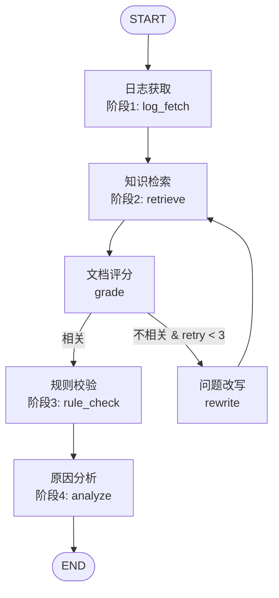

# NIO Diagnosis Agent

基于 **LangChain + LangGraph** 的 RAG Agent 工作流，模拟蔚来汽车效能平台的 AI 智能诊断系统。

## 项目背景

本项目复刻并升级了蔚来效能平台中的故障智能诊断系统，将原有的"四阶段流水线"升级为具有状态管理和条件路由的 RAG Agent。

### 核心能力

- **日志自动获取**：从车载系统异常日志库中按条件筛选日志
- **知识检索（RAG）**：基于 FAISS 向量检索历史故障案例 + 关键词检索测试报告
- **规则校验**：基于业务 Schema 对错误码进行结构化校验
- **原因分析**：由 LLM 综合日志、案例、规则生成结构化诊断报告
- **智能重试**：检索结果不相关时自动改写问题并重试（最多3次）

## 技术架构

```
LangChain (LCEL)          -> RAG 组件层：文档加载、向量化、检索
LangGraph (StateGraph)    -> Agent 编排层：四阶段流水线、条件路由、状态管理
FastAPI + SSE             -> Web API 层：实时流式推送节点执行状态
React + Tailwind          -> 前端展示层：步骤条进度可视化、诊断报告渲染
DeepSeek / 通义千问        -> LLM 推理层：问题改写、文档评分、答案生成
FAISS                     -> 向量存储层：本地轻量级，无需额外服务
```

### 为什么选择 LangChain + LangGraph？

| 需求 | 解决方案 | 原因 |
|------|----------|------|
| RAG 基础能力 | LangChain | 提供 Document Loaders、Embeddings、Vector Stores 等完整链路 |
| 四阶段流水线 | LangGraph | 有条件分支和循环需求，LangGraph 的 StateGraph 天然支持 |
| 国内模型适配 | LangChain 集成 | 通过 langchain-deepseek / langchain-tongyi 官方包支持 |
| 面试展示 | LangGraph + React | Agent 步骤条进度可视化 + 实时状态高亮，直观展示决策过程 |
| Web GUI | FastAPI + SSE + React | 浏览器可视化诊断，实时流式推送节点执行状态 |

## 快速开始

### 1. 环境准备

```bash
# Python >= 3.10
python -m venv venv
source venv/bin/activate  # macOS/Linux

# 安装依赖
pip install -e .
```

### 2. 配置 LLM API Key

```bash
# 复制环境变量模板
cp .env.example .env
```

支持 3 种配置方式（三选一）：

```bash
# 方式1：OpenAI 兼容 API（如阿里内部路由、vLLM、Ollama 等）
OPENAI_API_KEY=sk-your_key
OPENAI_BASE_URL=https://your-endpoint/v1
OPENAI_MODEL=deepseek-v3.2-thinking
EMBEDDING_PROVIDER=huggingface  # 端点不支持 embedding 时用本地模型

# 方式2：DeepSeek 官方 API
DEEPSEEK_API_KEY=your_key_here

# 方式3：通义千问 API
DASHSCOPE_API_KEY=your_key_here
```

### 3. 运行

#### CLI 模式

```bash
# 启动交互式 CLI
python -m src.main
```

#### Web GUI 模式

```bash
# 安装 Web 依赖（首次）
pip install -e ".[web]"
cd frontend && npm install && npm run build && cd ..

# 启动 Web GUI
python -m src.api.server
# 访问 http://localhost:8000
```

### 4. 运行测试

```bash
# 安装开发依赖
pip install -e ".[dev]"

# 运行测试
pytest tests/ -v
```

## 使用教程

### 模式一：Web GUI（推荐面试展示）

#### 1. 安装 Web 依赖

```bash
# 安装 Python Web 依赖
pip install -e ".[web]"

# 安装前端依赖并构建
cd frontend && npm install && npm run build && cd ..
```

#### 2. 启动 Web GUI

```bash
# 在项目根目录执行（必须在 langchain-prod/ 下，不能在 frontend/ 下）
python -m src.api.server

# 浏览器打开 http://localhost:8000
```

#### 3. 停止服务

```bash
# 方法一：终端中直接 Ctrl+C

# 方法二：按端口查找并终止
lsof -ti:8000 | xargs kill -9

# 方法三：按进程名查找并终止
pkill -f "src.api.server"
```

#### 4. 查看服务状态

```bash
# 检查进程是否在运行
ps aux | grep "src.api.server" | grep -v grep

# 检查端口是否被占用
lsof -i:8000

# 健康检查
curl http://localhost:8000/api/health
```

#### 5. 选择或输入故障问题

Web GUI 界面包含：
- **顶部**：6 个示例问题快捷按钮 + 自定义输入框 + 渐变启动按钮
- **步骤条**：紧凑水平进度指示器，5 个步骤实时状态变化（灰色 idle → 蓝色脉冲 running → 绿色对勾 completed）
- **内容区**：Tab 切换「执行日志」「诊断报告」
  - 执行日志：每个节点完成后实时追加卡片，带 SVG 图标、数据量摘要、评分结果、重试次数
  - 诊断报告：Markdown 渲染 LLM 生成的诊断报告 + 执行摘要面板

#### 6. 实时观察 Agent 决策过程

诊断过程中：
- 步骤条中节点依次亮起（蓝色脉冲 = running，绿色对勾 = completed），连接线实时变色
- 执行日志面板实时滚动每个节点的输出卡片（含 SVG 图标 + 数据摘要）
- 原因分析完成后自动切换到「诊断报告」Tab，展示 Markdown 格式的诊断报告

#### 7. 查看诊断报告

诊断完成后，「诊断报告」Tab 显示：
- **执行摘要**：评分结果、重试次数、日志/检索/规则数据量
- **诊断报告**：包含故障概述、根因分析、关联组件、解决方案、风险评估、复盘建议

---

### 模式二：CLI（终端模式）

#### 1. 启动交互式 CLI

```bash
python -m src.main
```

启动后会显示欢迎横幅、当前配置信息和 Agent 图结构，然后进入交互循环。

#### 2. 选择或输入故障问题

CLI 启动后显示 20 个示例问题。直接输入序号（1-20）选择示例，或直接输入自定义故障描述：

```
示例问题（直接输入序号即可）：
  1. BMS 充电握手超时，CML 报文延迟 12s，帮我分析原因
  2. BMS 高温降温延迟，液冷泵 15s 才启动
  3. BMS 电芯电压不均衡，压差 80mV 超出 50mV 阈值
  4. BMS SOC 显示 30% 实际 22%，续航估算偏差大
  5. BMS 绝缘电阻降至 50kΩ 低于 100kΩ 安全阈值
  6. AEB 在强光环境下没有触发制动，置信度只有 0.72，怎么回事？
  7. LKA 弯道居中偏移 0.35m 超出阈值，R250m 弯道处
  8. ACC 前车正常减速时误触发 AEB 紧急制动
  9. 盲区检测漏检，侧后方摩托车 BSM 未报警
  10. 前向碰撞预警延迟 1.5s，FCW 报警太晚
  11. NOMI 多轮对话上下文丢失，第3轮对话找不到导航目的地
  12. OTA 断点续传失败，下载到 60% 中断后从头开始下载
  13. HUD 导航箭头延迟 2s 显示，转弯时已过路口
  14. 蓝牙配对耗时 15s 超出 5s 超时阈值
  15. 雨天路面 VCU 扭矩分配不均，左右轮扭矩差 30Nm 车辆跑偏
  16. 动能回收力度波动，减速度在 0.1g 到 0.3g 之间跳变
  17. VCU 电压采样异常，报文丢失 3 帧
  18. 空气悬挂漏气，车身高度下降 30mm
  19. 方向盘低速转弯有咔咔异响，EPS 电机温度报警
  20. 空调压缩机不工作，出风口无冷风

请输入故障描述或问题序号 [1]:
```

- 输入 `1`-`20`：选择对应的示例问题
- 输入任意文字（如 `VCU 电压采样异常，报文丢失 3 帧`）：作为自定义故障问题进行诊断

#### 3. 查看诊断报告

输入问题后，Agent 会自动执行完整诊断流程，终端实时显示每个阶段的执行状态。流程结束后输出结构化诊断报告，包含：

- **故障概述**：错误码、异常现象、严重程度
- **根因分析**：结合日志数据和 CAN 信号的深度分析
- **关联案例**：匹配到的历史故障案例编号和处置经验
- **规则校验**：业务 Schema 规则匹配结果
- **解决方案**：可操作的修复建议

报告下方还会显示执行摘要（重试次数、日志/检索/规则数据量等）。

#### 4. 多轮交互

每次诊断完成后，可选择继续（输入 y）或退出（输入 n）。支持多轮对话，可连续诊断不同故障。

### 首次运行须知

首次运行时，系统会执行以下初始化操作（仅一次）：

1. **下载 HuggingFace Embedding 模型**（约 471MB，缓存到 `~/.cache/huggingface/`）
2. **构建 FAISS 向量库**（从 `historical_cases.csv` 构建并保存到 `vector_store/faiss_index/`）

首次启动可能需要 30-60 秒，后续运行会从缓存加载，秒级启动。

### 常见问题

| 问题 | 原因 | 解决方案 |
|------|------|----------|
| 启动报错 "未检测到 LLM API Key" | `.env` 文件未配置或路径不对 | 确认 `.env` 在项目根目录，包含有效的 API Key |
| embedding 报错 401 / ModelRouter 不存在 | 端点不支持 embedding API | 设置 `EMBEDDING_PROVIDER=huggingface` |
| 首次启动很慢 | 正在下载 HuggingFace 模型 | 等待下载完成，后续从缓存加载 |
| 诊断报告内容为空 | LLM API 调用失败 | 检查网络连接和 API Key 有效性 |
| FAISS 向量库不存在 | 首次运行会自动构建 | 无需手动操作，自动创建 `vector_store/` 目录 |

## 项目结构

```
langchain-prod/
├── pyproject.toml              # 项目依赖（含 [web] 可选依赖）
├── .env.example                # 环境变量模板
├── data/                       # Mock 数据
│   ├── test_reports.json       # 测试报告（16条）
│   ├── anomaly_logs.json       # 异常日志（24条）
│   ├── historical_cases.csv    # 历史故障案例（24条）
│   └── business_schema.json    # 业务 Schema（28个错误码 + 13条校验规则）
├── src/
│   ├── config.py               # 配置管理
│   ├── tools/                  # Agent 工具
│   │   ├── log_fetcher.py      # 日志获取工具
│   │   ├── knowledge_retriever.py  # RAG 知识检索工具
│   │   └── rule_validator.py   # 规则校验工具
│   ├── nodes/                  # LangGraph 节点
│   │   ├── log_fetch_node.py   # 阶段1：日志获取
│   │   ├── retrieve_node.py    # 阶段2：知识检索
│   │   ├── grade_node.py       # 文档评分（条件路由）
│   │   ├── rewrite_node.py     # 问题改写
│   │   ├── rule_check_node.py  # 阶段3：规则校验
│   │   └── analyze_node.py     # 阶段4：原因分析
│   ├── api/                    # Web GUI API 层
│   │   ├── server.py           # FastAPI 应用入口（CORS + 静态文件 serve）
│   │   └── routes.py           # SSE 诊断端点 + 配置/健康检查端点
│   ├── graph.py                # LangGraph 图组装
│   └── main.py                 # 交互式 CLI 入口
├── frontend/                   # React 前端
│   ├── package.json            # 前端依赖
│   ├── vite.config.ts          # Vite 配置（API 代理 + 生产构建输出）
│   └── src/
│       ├── App.tsx             # 主组件（状态管理 + SSE 事件分发）
│       ├── api/client.ts       # SSE 客户端（fetch + ReadableStream）
│       ├── types/events.ts     # TypeScript 类型定义
│       └── components/
│           ├── StepIndicator.tsx    # 步骤条进度指示器（SVG 图标 + 连接线）
│           ├── ExecutionLog.tsx     # 实时执行日志（SVG 图标 + 卡片样式）
│           ├── DiagnosisReport.tsx  # Markdown 诊断报告
│           └── QuestionInput.tsx    # 问题输入 + 示例按钮
└── tests/
    └── test_graph.py           # 集成测试（18个用例）
```

## Agent 工作流



- **阶段1 日志获取**：从 Mock 日志库按条件筛选异常日志
- **阶段2 知识检索**：FAISS 向量检索历史案例 + 关键词检索测试报告
- **文档评分**：LLM 评估检索结果相关性，不相关则改写问题重试（最多3次）
- **阶段3 规则校验**：正则提取错误码，查询 Business Schema 校验规则
- **阶段4 原因分析**：LLM 综合日志、案例、规则生成结构化诊断报告

## 示例问题

以下问题均可直接在 CLI 中输入或作为自定义问题描述，RAG Agent 会自动检索历史案例、测试报告和规则进行诊断：

### BMS 电池管理系统

1. BMS 充电握手超时，CML 报文延迟 12s，帮我分析原因
2. BMS 高温降温延迟，液冷泵 15s 才启动
3. BMS 电芯电压不均衡，压差 80mV 超出 50mV 阈值
4. BMS SOC 显示 30% 实际 22%，续航估算偏差大
5. BMS 绝缘电阻降至 50kΩ 低于 100kΩ 安全阈值

### ADAS 高级驾驶辅助

6. AEB 在强光环境下没有触发制动，置信度只有 0.72，怎么回事？
7. LKA 弯道居中偏移 0.35m 超出阈值，R250m 弯道处
8. ACC 前车正常减速时误触发 AEB 紧急制动
9. 盲区检测漏检，侧后方摩托车 BSM 未报警
10. 前向碰撞预警延迟 1.5s，FCW 报警太晚

### ICM 智能座舱

11. NOMI 多轮对话上下文丢失，第3轮对话找不到导航目的地
12. OTA 断点续传失败，下载到 60% 中断后从头开始下载
13. HUD 导航箭头延迟 2s 显示，转弯时已过路口
14. 蓝牙配对耗时 15s 超出 5s 超时阈值

### VCU 整车控制器

15. 雨天路面 VCU 扭矩分配不均，左右轮扭矩差 30Nm 车辆跑偏
16. 动能回收力度波动，减速度在 0.1g 到 0.3g 之间跳变
17. VCU 电压采样异常，报文丢失 3 帧

### 底盘 / 转向 / 空调

18. 空气悬挂漏气，车身高度下降 30mm
19. 方向盘低速转弯有咔咔异响，EPS 电机温度报警
20. 空调压缩机不工作，出风口无冷风

## 面试 Talking Points

1. **技术选型深度**：展示 LangChain vs LangGraph 的选型思考，说明为什么四阶段流水线需要 LangGraph 的 StateGraph 而非 LangChain 的线性 chain
2. **工程能力**：State 设计（TypedDict + Annotated）、条件路由（conditional_edges + route_after_grading）、重试机制（retry_count + MAX_RETRY_COUNT 限制）、LLM API 重试+降级（MAX_LLM_RETRIES=3，失败后降级输出原始数据）、每步耗时展示
3. **Web GUI 全栈能力**：FastAPI + SSE 实时流式推送 + React 步骤条进度可视化，后端核心代码零改动，`graph.stream()` 替代 `graph.invoke()` 获取节点级状态更新
4. **业务理解**：Mock 数据覆盖 BMS/ADAS/ICM/VCU/底盘/转向/HVAC 七大域 24 个故障案例，含真实错误码、CAN 信号、堆栈信息
5. **可扩展性**：说明如何从 Demo 扩展到生产（Mock 数据 -> 真实 API、FAISS -> Milvus、Memory -> Postgres、添加 LangSmith 追踪）

## 从 Demo 到生产

| 组件 | Demo | 生产环境 |
|------|------|----------|
| 数据源 | 本地 JSON/CSV | ELK 日志系统 + 数据库 API |
| 向量库 | FAISS (本地) | Milvus / Qdrant (分布式) |
| 状态持久化 | 内存 | Postgres (LangGraph Checkpointer) |
| LLM | DeepSeek / 通义千问 | 根据成本/延迟动态路由 |
| 监控 | rich 终端输出 | LangSmith 追踪 + Prometheus 指标 |
| 部署 | python -m src.main | FastAPI Web GUI + Docker + K8s |
| 前端 | 无（终端输出） | React 步骤条进度可视化 + Markdown 报告渲染 |
